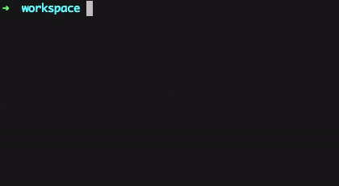

# Create Alem dApp


Create dApps with no build configuration and deploy them to NEAR Bos (NEAR blockchain).

Get to know more about [**Alem Library**](https://github.com/wpdas/alem).

Create Alem dApp works on macOS, Windows, and Linux.<br>
If something doesn’t work, please file an issue.<br>
If you have questions or need help, please ask in the [Alem Discussions](t.me/alemlib/8).

## Quick Overview

```sh
npx create-alem-dapp my-app
cd my-app
npm start
```

If you want to use Typescript, you can use the typescript template like so:

```sh
npx create-alem-dapp my-app --template typescript
cd my-app
npm start
```

<p align='center'>

</p>

## Creating an App

**You’ll need to have Node 18.0.0 or later version on your local development machine**. You can use [nvm](https://github.com/creationix/nvm#installation) (macOS/Linux) or [nvm-windows](https://github.com/coreybutler/nvm-windows#node-version-manager-nvm-for-windows) to switch Node versions between different projects.

To create a new app, you may choose one of the following methods:

### Npx

```sh
npx create-alem-dapp my-app
```

### Yarn

```sh
yarn create alem-dapp my-app
```

It will create a directory called `my-app` inside the current folder.<br>
Inside that directory, it will generate the initial project structure and install the dependencies:

No configuration or complicated folder structures, only the files you need to build your app.<br>
Once the installation is done, you can open your project folder:

```sh
cd my-app
```

Inside the newly created project, you can run some built-in commands:

### `npm start` or `yarn start`

Runs the app in development mode.<br>
If it doesn't open automatically, open [http://localhost:8080](http://localhost:8080) or [http://127.0.0.1:8080](http://127.0.0.1:8080) to view it in the browser.

The page will automatically reload if you make changes to the code.<br>
You will see the build errors and lint warnings in the console.

## Contributing

We'd love to have your helping hand on `create-alem-dapp`!

## License

Create Ale dApp is open source software [licensed as MIT](https://github.com/wpdas/create-alem-dapp/blob/main/LICENSE).
